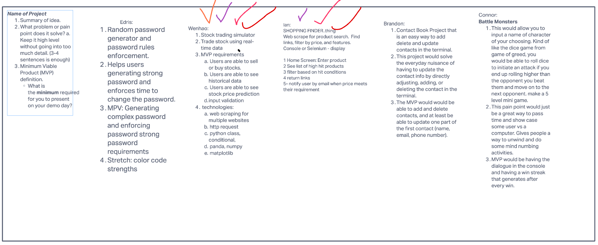
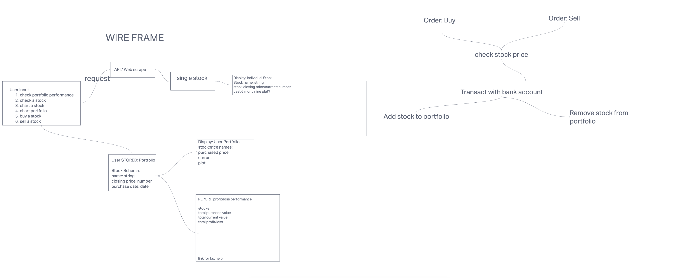
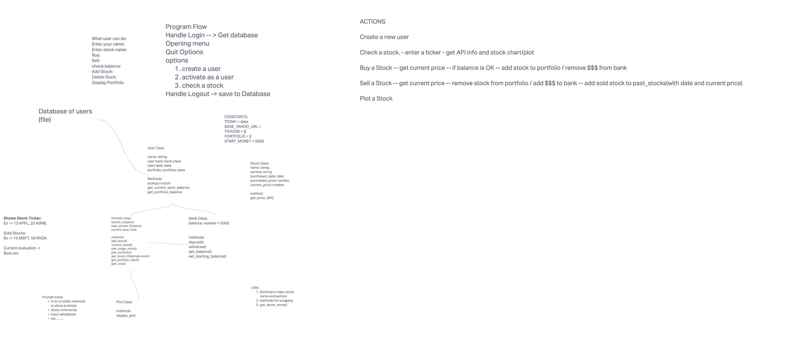

# Project Battle Stocks

**Contributors**: Brandon Mizutani,Connor Boyce, Edris Berg, Ian Cargill, Wenhao Piao

Our project is a stock trading simulator that allows trading stock using real-time data. Our project will allow users to sell or buy stocks, are able to see historical data, the ability to see stock price prediction, and input validation.

## Project Ideas

## Git Hub Project

[GitHub Project](https://github.com/orgs/battlestocks/projects/1)

## Wire Frame

## Project Planning

## Version 1.0.0 - 02/19/2022

For our mvp, our application allows the user to create a portfolio, giving the option to purchase, sell, or plot stocks.

The user is guided through a series of prompts. The first prompt requires the user to to enter a username for their stock portfolio. When the user enters a username, they can choose whether they want to use our app. If they choose yes, they are then given the option to either buy or sell stocks, plot their stock portfolio, as well as the option to quit the app entirely.

They are automatically given an amount of $10,000. The user is required to purchase a stock before they can sell anything. Once a stock is in their portfolio, the user can then sell the stock. The monetary amount for the stock is then directly deposited into their account. The user can also plot the graph and will appear on the user's computer screen. The app will continue to loop the user into either buying or selling until they quit the application.

## Tools Used

- GitHub (version control)
- GitHub Project (Project management)
- Slack (communication)
- InvisionApp (Wireframe)
- BeautifulSoup (Web Scraping)
- matplotlib (ploting)
- pandas (Data manipulation and analysis)
- Yahoo Finance (Web Scraping and stock prices)
